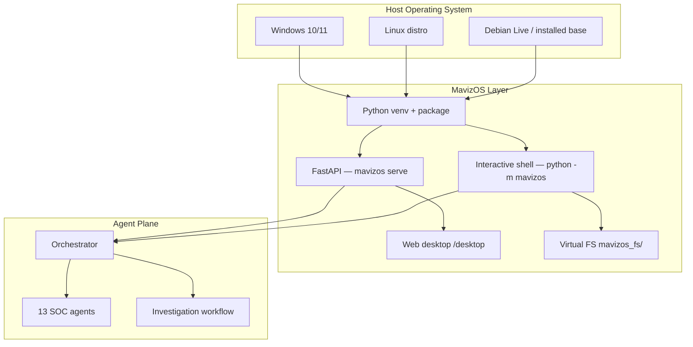

# MavizOS Production Installation

Install MavizOS as a **dedicated AI SOC appliance** on Windows, Linux, or as a bootable live ISO.

| Mode | Host OS | MavizOS role |
|------|---------|-----------------|
| **Appliance** | Windows / Linux remain installed | Primary experience: shell + API + web desktop |
| **Development** | Your existing workstation | `pip install -e .` in a project venv (see [README.md](README.md)) |
| **Live ISO** | Debian live inside VM or bare metal | OS image with MavizOS pre-installed |

## How It Works

MavizOS installs **on top of** your existing Windows or Linux system — it does not replace the host kernel. After install, analysts get a dedicated SOC layer: interactive shell, REST API, web desktop, and 13 autonomous agents orchestrated through a 10-step investigation workflow.

**For executives:** Think of MavizOS as a security operations appliance that sits beside your normal OS. Install once, autostart at login, triage alerts, and receive structured 14-section reports — without reimaging workstations.

**For engineers:** Python venv + editable package, FastAPI on port 8000, virtual filesystem under `mavizos_fs/`, systemd or scheduled-task autostart, optional ISO for air-gapped live SOC nodes.


*Host OS remains; MavizOS provides the kernel layer (API, shell, web desktop, VFS), agent plane, and integration adapters.*


*An incoming alert triggers the orchestrator’s 10-step investigation; output is a 14-section report in the virtual filesystem, with approval gates for destructive remediation.*


## Safety warnings (read first)

1. **These installers do not wipe Windows or Linux.** They do not delete `System32`, format `C:`, or remove the host operating system.
2. **Windows still requires the Windows kernel.** MavizOS runs as the dedicated SOC application layer on top of Windows.
3. **Appliance mode** may disable third-party startup programs (with backup) when you run `configure-appliance.ps1`. Review changes before production.
4. **ISO `dd` to USB** overwrites the target device. Double-check `/dev/sdX`.
5. **Demo mode** is enabled by default (`.env.example`). Disable `MavizOS_DEMO_MODE` for production.
6. **Change default passwords** on any ISO/preseed install before network exposure.

## Architecture

*See [How It Works](#how-it-works) for the architecture diagram. Appliance mode keeps Windows/Linux; MavizOS is the primary SOC experience.*



## Prerequisites

| Platform | Requirements |
|----------|--------------|
| Windows | Windows 10/11, **Administrator** PowerShell, Python 3.11+ (installer can use winget/choco) |
| Linux | Debian/Ubuntu/RHEL/Fedora, **root**, Python 3.11+, `python3-venv` |
| ISO build | Linux or WSL2, Docker optional, 20+ GB disk, 30–90 min build time |

Version is read from [`VERSION`](VERSION) or `pyproject.toml`.

---

## Windows installation


*Administrator PowerShell runs `install.ps1`, syncs the project to `C:\MavizOS`, creates venv + scheduled task, and launches the SOC shell or web desktop on port 8000.*


### Install (appliance)

```powershell
# Run as Administrator
cd "D:\Agentic OS"
Set-ExecutionPolicy -Scope Process -ExecutionPolicy Bypass
.\install\windows\install.ps1 -Autostart -ConfigureAppliance
```

Options:

| Parameter | Description |
|-----------|-------------|
| `-InstallRoot` | Default `C:\MavizOS` |
| `-SkipPythonInstall` | Fail if Python missing instead of using winget/choco |
| `-ConfigureAppliance` | Run startup hardening (optional) |

### What gets installed

- Project synced to `C:\MavizOS`
- Virtualenv at `C:\MavizOS\.venv`
- Editable install: `pip install -e .`
- Scheduled task **MavizOS-Shell-Autostart** (logon)
- Desktop shortcut **mavizos.lnk**
- Launcher: `C:\MavizOS\install\windows\mavizos-shell.cmd`

### Daily use

```cmd
C:\MavizOS\install\windows\mavizos-shell.cmd
```

API + web desktop:

```powershell
C:\MavizOS\.venv\Scripts\mavizos.exe serve
# http://localhost:8000/desktop
```

### Optional appliance hardening

```powershell
.\install\windows\configure-appliance.ps1 -DisableStartupApps -SetSentinelFirst
.\install\windows\configure-appliance.ps1 -KioskHintsOnly
```

### Windows uninstall / rollback

```powershell
.\install\windows\uninstall.ps1
.\install\windows\uninstall.ps1 -RemoveInstallDir   # prompts for YES
.\install\windows\uninstall.ps1 -RemoveInstallDir -Force
```

Removes scheduled task and shortcut. `-RemoveInstallDir` deletes `C:\MavizOS` after confirmation.

---

## Linux installation


*`install.sh` (root) deploys to `/opt/mavizos`, enables `mavizos.service` on port 8000, and optionally autologin on tty1 for a dedicated SOC console.*

```mermaid
flowchart LR
    S[install.sh] --> O[/opt/mavizos]
    O --> U[systemd]
    U --> A[API :8000]
    A --> H[Shell REPL]
```

### Install (dedicated node)

```bash
cd /path/to/MavizOS
sudo chmod +x install/linux/install.sh install/linux/uninstall.sh
sudo ./install/linux/install.sh
```

Environment variables:

| Variable | Default | Description |
|----------|---------|-------------|
| `MavizOS_INSTALL_ROOT` | `/opt/mavizos` | Install path |
| `ENABLE_API` | `1` | Enable `mavizos.service` |
| `ENABLE_AUTOLOGIN` | `0` | Autologin `MavizOS` on tty1 |
| `ENABLE_SHELL_SERVICE` | `0` | Create `mavizos-shell@` template |

Autologin example:

```bash
sudo ENABLE_AUTOLOGIN=1 ./install/linux/install.sh
```

### What gets installed

- System user `MavizOS`
- Files under `/opt/mavizos`
- systemd unit: `mavizos.service` (API on port 8000)
- Optional: `mavizos-getty@tty1.service` for console autologin

### Daily use

```bash
sudo systemctl status MavizOS
sudo -u MavizOS /opt/mavizos/.venv/bin/python -m mavizos
curl http://localhost:8000/api/v1/health
```

### Minimal server profile

For headless SOC nodes:

- Disable desktop environment on the host
- Set `MavizOS_API_HOST=0.0.0.0` in `/opt/mavizos/.env`
- Put reverse proxy (nginx) with TLS in front of port 8000
- Firewall: allow only management networks to 8000

### Linux uninstall

```bash
sudo ./install/linux/uninstall.sh
sudo REMOVE_DATA=1 ./install/linux/uninstall.sh
```

---

## Bootable ISO


*Build produces `dist/mavizos-os-*.iso`; boot into Debian live with MavizOS pre-installed at `/opt/mavizos`, then use shell or `http://127.0.0.1:8000/desktop`.*

```mermaid
flowchart LR
    B[build-iso.sh] --> I[ISO]
    I --> L[Debian Live]
    L --> P[/opt/mavizos]
    P --> W[SOC shell / desktop]
```

See **[install/iso/README-ISO.md](install/iso/README-ISO.md)** for full detail.

### Build

```bash
# Linux / WSL2
chmod +x install/iso/build-iso.sh
./install/iso/build-iso.sh
```

```powershell
# Windows → WSL2
.\install\iso\build-iso.ps1
```

Output: `dist/mavizos-os-<version>-amd64.iso`

### Boot

1. Attach ISO in VirtualBox/VMware or flash to USB with `dd`
2. Boot the VM/machine
3. Open `http://127.0.0.1:8000/desktop` or log in as `MavizOS` and run `python -m mavizos`

---

## Install layout reference

```
install/
  windows/     install.ps1, uninstall.ps1, configure-appliance.ps1, mavizos-shell.cmd
  linux/       install.sh, uninstall.sh, mavizos.service, mavizos-getty.service
  iso/         build-iso.sh, build-iso.ps1, Dockerfile.builder, preseed/, chroot-hooks/
```

| Platform | Install root | venv |
|----------|--------------|------|
| Windows | `C:\MavizOS` | `C:\MavizOS\.venv` |
| Linux | `/opt/mavizos` | `/opt/mavizos/.venv` |
| ISO (live) | `/opt/mavizos` | `/opt/mavizos/.venv` |

---

## Uninstall summary

| Platform | Command | Data removal |
|----------|---------|--------------|
| Windows | `install\windows\uninstall.ps1` | Optional `-RemoveInstallDir` |
| Linux | `sudo install/linux/uninstall.sh` | `REMOVE_DATA=1` |
| ISO | N/A (ephemeral live) or reinstall host OS | — |

---

## Support

- Development quickstart: [README.md](README.md)
- ISO specifics: [install/iso/README-ISO.md](install/iso/README-ISO.md)
