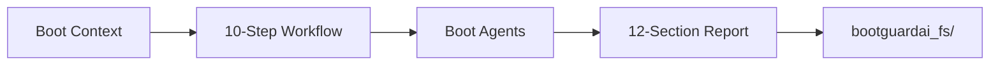
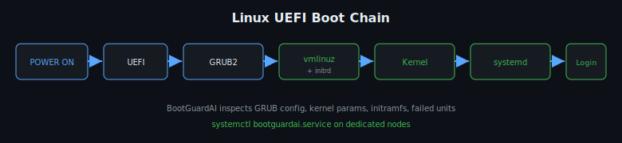

# BootGuardAI Installation Guide


BootGuardAI installs as a **separate product** from mavizos. Installers are **non-destructive** — they do not wipe the OS, delete System32, or reformat drives.


## How It Works


BootGuardAI analyzes the **boot chain** from firmware through login — on Windows (UEFI → bootmgfw → BCD → kernel) and Linux (UEFI → GRUB → kernel → systemd). It collects boot context, runs a 10-step diagnostic workflow, and produces a **12-section structured report**. Destructive fixes (BCD edits, boot file changes) require **analyst approval**.


**For executives:** BootGuardAI is a boot-health SOC appliance that diagnoses “won’t boot” and slow-boot issues without automatically breaking systems. Install alongside MavizOS or standalone; analysts stay in control of any fix that touches boot files.


**For engineers:** Separate package under `bootguardai/`, API on port **8081**, VFS at `bootguardai_fs/`, Windows install to `C:\BootGuardAI`, Linux to `/opt/bootguardai`, optional ISO appliance.


*Boot chain stages feed the analysis stack (context collector, 10-step engine, agents, API). Safe mode keeps fixes gated; reports land in the BootGuard VFS.*


*Boot logs, BCD/GRUB config, and event data enter the 10-step workflow; output is a 12-section diagnostic report with an approval queue for destructive remediation.*





## Safety


- Windows: copies to `C:\BootGuardAI` only

- Linux: installs to `/opt/bootguardai` only

- Destructive boot fixes require **analyst approval** in the platform


*Three install paths share the same layout: venv, editable package, API on 8081, and virtual filesystem — none modify host boot files at install time.*


```mermaid

flowchart TB

    subgraph Win["Windows"]

        WP[install.ps1] --> WC[C:\BootGuardAI]

    end

    subgraph Lin["Linux"]

        LP[install.sh] --> LO[/opt/bootguardai]

    end

    subgraph ISO["ISO"]

        IB[build-iso.sh] --> ID[dist/*.iso]

    end

```


## Windows


*Power-on through UEFI, bootmgfw.efi, BCD, winload, kernel, and login — each stage is a diagnostic checkpoint.*


```powershell

# Run as Administrator

cd "d:\Agentic OS"

.\install\bootguardai\windows\install.ps1

```


Uninstall:


```powershell

.\install\bootguardai\windows\uninstall.ps1

```


## Linux





*GRUB and initramfs load the kernel; systemd brings up services; BootGuardAI correlates failed units and boot delays.*


```bash

sudo bash install/bootguardai/linux/install.sh

sudo systemctl start bootguardai

```


Uninstall:


```bash

sudo bash install/bootguardai/linux/uninstall.sh

```


## ISO Appliance


See [install/bootguardai/iso/README-ISO.md](install/bootguardai/iso/README-ISO.md).


```bash

bash install/bootguardai/iso/build-iso.sh

# Artifact: dist/bootguardai-os-<version>.iso

```


## Environment


```env

BOOTGUARD_DEMO_MODE=true

BOOTGUARD_API_PORT=8081

BOOTGUARD_VFS_ROOT=./bootguardai_fs

```


## Uninstall


| Platform | Command |

|----------|---------|

| Windows | `install\bootguardai\windows\uninstall.ps1` |

| Linux | `install/bootguardai/linux/uninstall.sh` |


---


## Visual reference


All diagrams (SVG + Mermaid) live under [`docs/images/bootguardai/`](docs/images/bootguardai/). For MavizOS install visuals, see [INSTALL.md](INSTALL.md) and [`docs/images/MavizOS/`](docs/images/MavizOS/).


