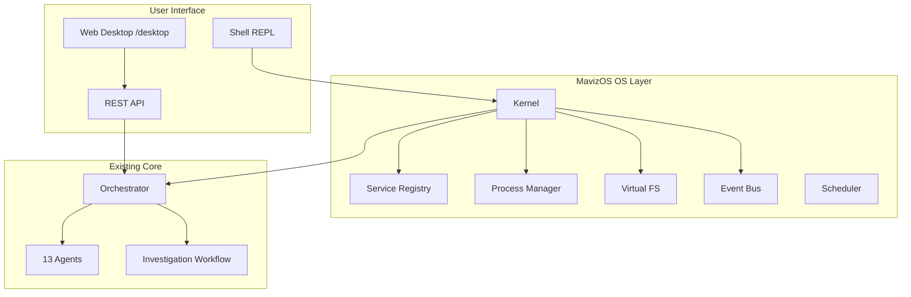

# MavizOS

**Autonomous Agentic AI SOC Operating System** — a distributed multi-agent cybersecurity intelligence platform for enterprise SOC operations.

## Features

- **13 specialized agents**: Alert triage, threat intel, investigation, malware analysis, MITRE ATT&CK, SOAR automation, detection engineering, threat hunting, compliance, reporting, memory, email security, cloud security
- **Central orchestrator**: Task delegation, context sharing, workflow execution, escalation
- **10-step investigation pipeline** with **14-section structured reports**
- **Approval gates** for destructive remediation (block, isolate, quarantine, etc.)
- **Audit logging** for all automated actions
- **Organizational memory** (in-memory + JSON persistence)
- **Integration adapters** (abstract interfaces + mock/demo implementations)
- **REST API** via FastAPI

## MavizOS as an Operating System

MavizOS is not only a Python API — it boots like a **SOC operating system** with a kernel, agent services, virtual filesystem, process table, and interactive shell.

### Boot the OS (Interactive Shell)

```bash
python -m mavizos          # default: boot + shell
python -m mavizos.boot     # explicit boot module
MavizOS                    # console script (after pip install -e .)
```

You will see an ASCII boot sequence, agent services starting, and land at:

```
MavizOS>
```

### Shell Commands

| Command | Purpose |
|---------|---------|
| `help` | Command list |
| `status` | System + agent services health |
| `agents` | List registered agents |
| `ps` | Running investigations/processes |
| `triage <file\|json>` | Run triage |
| `investigate` | Start investigation (sample alert) |
| `hunt [hypothesis]` | Threat hunt |
| `incidents` | List incidents |
| `incident <id>` | Show incident + report |
| `approvals` | Pending approval queue |
| `approve <id>` | Approve action (demo) |
| `audit` | Recent audit log |
| `fs ls [path]` | Virtual filesystem navigation |
| `fs cat <path>` | Read report/log from VFS |
| `fs tree [path]` | Directory tree |
| `clear` | Clear screen |
| `shutdown` | Graceful exit |

### Virtual Filesystem

Artifacts are stored under `./mavizos_fs/`:

```
mavizos_fs/
├── etc/
├── var/
│   ├── incidents/    # Incident snapshots
│   ├── reports/      # 14-section investigation reports
│   ├── logs/         # Triage, hunt, system logs
│   ├── iocs/         # IOC bundles (simulated in demo)
│   └── audit/
└── home/
```

### OS Architecture



```
MavizOS/os/
├── kernel/       # Boot, event bus, scheduler, service registry
├── services/     # Agent service manager
├── filesystem/   # Virtual FS (mavizos_fs/)
├── processes/    # PID table for investigations/hunts
├── shell/        # Interactive REPL + commands
├── config/       # /etc/mavizos/ style config
└── desktop/      # Web SOC desktop (static SPA)
```

Configuration: `etc/mavizos/config.json` (hostname, VFS root, prompt).

## Production Installation

Deploy MavizOS as a **dedicated AI SOC appliance** (Windows workstation, Linux node, or bootable ISO).

**Full guide:** [INSTALL.md](INSTALL.md)

| Platform | Command |
|----------|---------|
| Windows (Admin PowerShell) | `.\install\windows\install.ps1 -Autostart` |
| Linux (root) | `sudo ./install/linux/install.sh` |
| Bootable ISO | `./install/iso/build-iso.sh` (Linux/WSL2) → `dist/mavizos-os-*.iso` |

Installers are **non-destructive**: they do not wipe the host OS. See [INSTALL.md](INSTALL.md) for safety warnings, uninstall steps, and architecture.

**Install visuals:** Step-by-step SVG diagrams and Mermaid fallbacks are in [INSTALL.md](INSTALL.md) (`docs/images/MavizOS/`) and [INSTALL_BOOTGUARD.md](INSTALL_BOOTGUARD.md) (`docs/images/bootguardai/`).

## Quickstart

### Prerequisites

- Python 3.11+

### Install

```bash
cd "d:\Agentic OS"
python -m venv .venv
.venv\Scripts\activate        # Windows
pip install -r requirements.txt
pip install -e .                # optional: MavizOS CLI
```

### Boot MavizOS (Shell)

```bash
python -m mavizos
```

### Run API Server + Web Desktop

```bash
python -m mavizos.main
# or: mavizos serve
```

- API docs: http://localhost:8000/docs
- Web desktop: http://localhost:8000/desktop

### Run Demos

```bash
python scripts/demo.py       # Original API-style demo
python scripts/os_demo.py    # Boot + shell commands (scripted)
```

### Run Tests

```bash
pytest -v
```

## API Endpoints

| Method | Endpoint | Description |
|--------|----------|-------------|
| GET | `/api/v1/health` | Health check |
| GET | `/api/v1/agents` | List registered agents |
| POST | `/api/v1/alerts/triage` | Triage a single alert |
| POST | `/api/v1/investigate` | Full investigation workflow |
| GET | `/api/v1/incidents/{id}` | Get incident |
| POST | `/api/v1/hunt` | Threat hunting |
| POST | `/api/v1/detections/generate` | Generate detection rules |
| GET | `/api/v1/approvals/pending` | List pending approvals |
| POST | `/api/v1/approvals/{id}/approve` | Approve destructive action |
| GET | `/api/v1/audit` | Audit log |

### Example: Investigate Alert

```bash
curl -X POST http://localhost:8000/api/v1/investigate \
  -H "Content-Type: application/json" \
  -d '{
    "alerts": [{
      "title": "Suspicious encoded PowerShell",
      "description": "Encoded PowerShell detected",
      "severity": "high",
      "source": "edr",
      "host": "WORKSTATION-42",
      "user": "jsmith",
      "ip_address": "203.0.113.50",
      "process": "powershell.exe",
      "file_hash": "a1b2c3d4e5f6789012345678abcdef01"
    }]
  }'
```

## Architecture

```
MavizOS/
├── __main__.py          # python -m mavizos → shell
├── boot.py              # python -m mavizos.boot
├── main.py              # FastAPI + web desktop
├── config.py            # Environment config
├── os/                  # OS layer (kernel, shell, VFS, desktop)
├── orchestrator/        # Agent registry, routing
├── agents/              # 13 specialized agents
├── integrations/        # Vendor adapters (mock + stubs)
├── models/              # Pydantic domain models
├── workflows/           # Investigation pipeline
├── memory/              # Organizational knowledge store
├── security/            # Approval gates, audit log
└── api/                 # REST routes
etc/mavizos/config.json   # OS config (/etc style)
```

## Security Model

| Autonomous (no approval) | Requires approval |
|--------------------------|-------------------|
| TI enrichment | Account disable |
| Ticket creation | Host isolation |
| Notifications | Firewall block |
| Timelines/summaries | Credential reset |
| Context gathering | Quarantine/deletion |

**Demo mode**: All threat intel is **simulated** and labeled `simulated: true`. Never treated as live intelligence.

## Configuration

Copy `.env.example` to `.env`:

```
MavizOS_DEMO_MODE=true
MavizOS_API_PORT=8000
MavizOS_MEMORY_PERSIST_PATH=./data/memory.json
MavizOS_AUDIT_LOG_PATH=./data/audit.log
```

## Production Hardening (Next Steps)

- Wire real SIEM/EDR/TI integrations (replace stubs in `integrations/stubs.py`)
- Add authentication/authorization (OAuth2, API keys, RBAC)
- Persistent database (PostgreSQL) for incidents and memory
- Message queue for async agent execution (Redis/RabbitMQ)
- LLM integration for analyst-assist summarization (with guardrails)
- Rate limiting and secrets management (Vault)
- Horizontal scaling with agent worker pools

## Related: BootGuardAI

See [README_BOOTGUARD.md](README_BOOTGUARD.md) and [INSTALL_BOOTGUARD.md](INSTALL_BOOTGUARD.md) for the separate boot analysis and security intelligence product (same monorepo, independent install paths).

## License

Proprietary — MavizOS Platform
